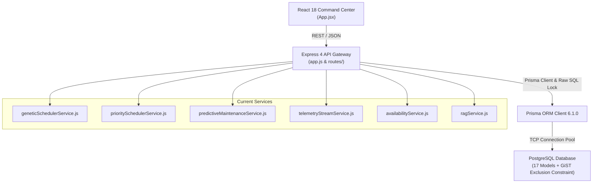

# KIẾN TRÚC BASELINE SMART LAB V1 TRƯỚC TÁI CẤU TRÚC (PHASE 0 ARCHITECTURE)

## 1. Sơ Đồ Khối Hiện Tại

## 2. Điểm Mạnh Hiện Tại
1. **Concurrency Protection Xuất Sắc**: GiST exclusion constraint (`bookings_no_active_overlap`) kết hợp `SELECT FOR UPDATE` đã loại bỏ hoàn toàn double-booking ở cấp database storage.
2. **Bộ Test Suite Vững Chắc**: 23/23 unit and concurrency tests chạy với Node.js built-in runner.
3. **UI Command Center Thẩm Mỹ**: React 18 với bộ icons Lucide, bản đồ số 2D và bảng điều khiển trực quan.

## 3. Các Khoảng Trống Kiến Trúc Cần Refactor Trong V2 (Theo Chỉ Đạo)
1. **Chuyển dịch trọng tâm**: Chuyển từ "Booking-centric" sang chuỗi "Requirement -> Allocation -> Optimization -> Digital Twin Feedback".
2. **Nâng cấp Stack Thuật toán**: Mở rộng từ đơn thuật toán GA sang bộ giải so sánh đa thuật toán: **Baseline (FIFO, Greedy, Round Robin)** vs **Advanced (GA, NSGA-II với Pareto Frontier)**.
3. **Policy-Driven Engine**: Đưa biểu giá điện (khung giờ cập nhật 2026), hạn mức công bằng, chính sách ưu tiên ra khỏi code cứng thành thực thể `PolicyVersion`.
4. **Decision Provenance**: Lưu vết `OptimizationRun` và `OptimizationDecision` để giải trình "Tại sao hệ thống chọn phương án này".
5. **Research & Experiment Pack**: Xây dựng thư mục `research/` độc lập với dataset generator (seed cố định), ablation study và statistical validation ($N=30/50$ runs).
