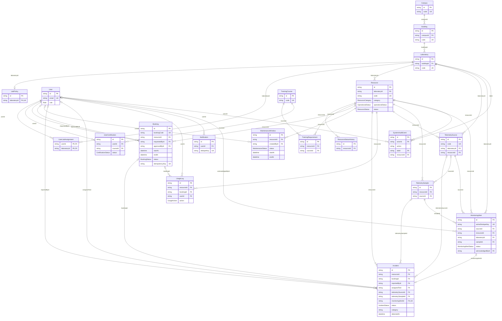
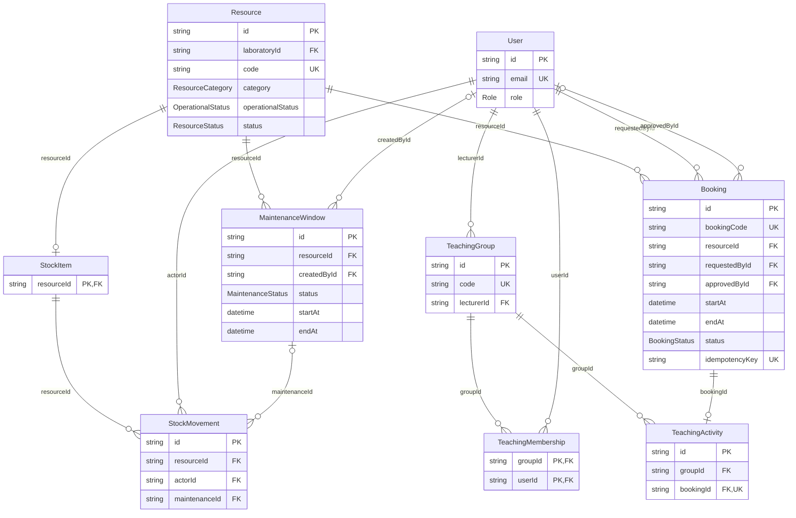

# Core laboratory data relationships

Generated from [canonical Prisma schema](../../backend/prisma/schema.prisma).
Schema SHA-256 after LF normalization: `05474bc357ba9a6e743ffd114575a0f885e9189177e91ff7fd203980d106bccd`.
Run `npm run docs:erd` in `backend/`; CI verifies `docs:erd:check`.
This is a selected model projection, not a claim that only these tables exist.
Foreign keys and cardinalities come from the generated Prisma data model checked
against the source schema. The current schema contains 48 models.

## Required booking operations and persisted monitoring

The 20 models cover identity/lab scope, resource policy, training eligibility,
booking, handover history, maintenance, incident handling, notification and
configured telemetry. Resource operational state and scheduling availability
remain separate. `UserLabAssignment` has a composite key; missing assignments
grant staff no laboratory access. Nullable relations are shown as optional.

PostgreSQL's `bookings_no_active_overlap` exclusion constraint and resource row
locks protect active booking intervals `[startAt, endAt)`. Prisma cannot express
the exclusion constraint; see tracked migrations and the concurrency tests.
History/audit records describe persisted events, not proof of physical inspection.

## Approved stock and teaching workspace extension

Stock movements record receipts, issues and admin adjustments. A maintenance-linked
issue must remain in the same laboratory. Teaching groups represent lecturer
supervision; academic endorsement does not grant resource approval or handover.
Payment, shipment, AI, camera and optimization tables are outside this diagram's
core projection. Their presence in the schema does not certify those integrations.
