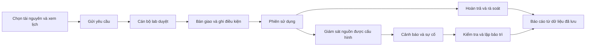

# Đối chiếu hướng triển khai và phạm vi đồ án

Ngày: 05/10/2026. Phạm vi: tiếp tục local theo yêu cầu đọc và tích hợp
`Hướng triển khai.docx`; chưa push Git, chưa mở Batch mới.

## Kết luận

Tài liệu giúp làm rõ vòng đời quản lý phòng và thiết bị. Đồ án nên thể hiện được
đặt lịch, duyệt, bàn giao, sử dụng, hoàn trả, xử lý sự cố và báo cáo, với AI hỗ trợ
tra cứu và giải thích. Một giao diện đặt lịch đẹp chưa chứng minh đủ nghiệp vụ.

Giữ React/Vite, Express, Prisma và PostgreSQL 16 đang có. Tài liệu tự ghi là
“Đề xuất hướng triển khai”; gợi ý Python, bảng Session mới và Digital Twin là
nguồn tham khảo. Các hợp đồng tốt nghiệp, trạng thái chuẩn và phân quyền hiện
tại vẫn là căn cứ triển khai. Mô phỏng phải có nhãn và được tách khỏi dữ liệu
phần cứng thực tế.

## Đối chiếu từng đề xuất

| Đề xuất trong Word | Dự án hiện tại | Cách tích hợp phù hợp |
|---|---|---|
| Bốn vai trò | ADMIN, LAB_STAFF, LECTURER, STUDENT; nhân viên theo lab, giảng viên theo nhóm học phần | Giữ vai trò và quyền hiện tại. Giảng viên duyệt hoạt động học tập; cán bộ lab duyệt tài nguyên và bàn giao |
| Phòng, thiết bị, vị trí, chính sách, lịch bảo trì | Laboratory, Resource, LabPolicy, MaintenanceWindow đã có | Dùng hồ sơ và lịch hiện tại; thông số chuyên môn nằm ở chi tiết tài nguyên |
| Booking, check-in, check-out, Session | Booking có actualStartAt/actualEndAt và lịch sử sử dụng | Phiên sử dụng được xác định bằng bàn giao/hoàn trả. Chưa tạo một bảng Session trùng nghiệp vụ |
| Available, Occupied, Fault | Bộ trạng thái chuẩn đã có | Dùng AVAILABLE, IN_USE, BROKEN…; không thêm Occupied/Fault hay trạng thái đặt lịch mới |
| SensorLog, Alert, ResourceLog | TelemetrySample, TelemetrySource, MonitoringAlert, Incident, UsageLog đã có | Tái sử dụng xác thực nguồn, ngưỡng, episode và bằng chứng; không tạo bộ bảng song song |
| Mô phỏng cảm biến mỗi 3–10 giây | Giám sát đã nhận mẫu từ nguồn xác thực; thiếu phần cứng và demo simulator đã được kiểm chứng | Chuẩn bị kịch bản độc lập có nhãn. Chưa đưa dữ liệu tổng hợp vào luồng giám sát sử dụng thật |
| Nhiệt độ phòng trên 32°C | Ngưỡng có thứ tự tài nguyên → lab → mặc định | 32°C là cấu hình minh họa của phòng trong preview. Không đổi mặc định cho mọi thiết bị |
| Quá nhiệt hoặc đủ giờ dùng tự chuyển bảo trì | Trạng thái vật lý do nghiệp vụ có thẩm quyền quyết định | Cảnh báo dẫn đến kiểm tra, tạo sự cố, lập bảo trì. Không tự đổi trạng thái vật lý hoặc hủy lịch chỉ vì mô phỏng |
| Điện năng, số người trong phòng | Chưa có nguồn đo và hợp đồng dữ liệu được kiểm chứng | Chưa hiển thị như số đo thật. Sức chứa/nhu cầu đặt phòng khác với số người thực tế |
| Báo cáo tuần/tháng, sử dụng nhiều/ít, lịch hủy | Dashboard cũ có chỉ số 30 ngày và danh sách tối đa 20 lịch | Đã thêm báo cáo 7/30 ngày, mức dùng từng tài nguyên, lịch hủy, không đến nhận, sự cố và bảo trì theo lịch |
| AI gợi ý, tóm tắt, dự báo hỏng | Trợ lý có tra cứu read-only, ngữ cảnh và tổng hợp; chưa bật nhà cung cấp | Ưu tiên tìm lịch phù hợp và tóm tắt có bằng chứng. Dự báo hỏng để sau khi có đủ dữ liệu và đánh giá sai số |
| Python backend và WebSocket | Express, PostgreSQL và API giám sát đã có | Giữ stack. Python chỉ là lựa chọn cho simulator hoặc nghiên cứu sau này; chưa cần đổi backend hoặc thêm hạ tầng streaming |
| 3–5 phòng, 15–30 thiết bị | Demo local hiện có 2 lab, 11 tài nguyên, có nhãn dữ liệu demo | Đây là quy mô dữ liệu mẫu để bảo vệ, không phải giới hạn sản phẩm. Chưa tự bơm thêm booking, lịch sử, số đo hoặc sự cố |
| Email, thanh toán, media, ESP32 | Có hợp đồng/tích hợp một phần, cần cấu hình nhà cung cấp riêng | Hoàn thiện nghiệp vụ trước. Không coi cấu hình chưa có hoặc thanh toán/email demo là đã thành công |

## Phần đã triển khai trong lần này

### 1. Báo cáo vận hành theo kỳ

Endpoint mới: `GET /api/dashboard/report?days=7` hoặc `days=30`.
Mặc định API là 30 ngày; giao diện mở ở 7 ngày. Kỳ là khoảng lùi đúng 7/30
ngày tính đến thời điểm lập báo cáo, không phải tuần ISO hoặc tháng dương lịch.
Giờ hiển thị theo Việt Nam.

- ADMIN đọc toàn hệ thống; LAB_STAFF chỉ đọc lab được phân công hiện tại.
- Nhân viên chưa có phân công nhận báo cáo rỗng; LECTURER/STUDENT bị từ chối.
- Không nhận userId, role hoặc laboratoryId từ người gọi để mở rộng quyền.
- SQL tổng hợp phía server trong một snapshot. Không tính tổng từ một trang
  booking/incident hay danh sách 20 dòng trên dashboard.
- Chỉ trả số tổng hợp và hồ sơ tài nguyên; không trả tên/email người đặt lịch.
- Giao diện VI/EN có chọn kỳ, bốn chỉ số chính, tối đa năm thanh so sánh khi
  thu gọn và nút xem toàn bộ/cách tính. Có loading, báo cáo rỗng, lỗi và thử lại.
- Khi đổi kỳ, số liệu cũ được ẩn; request cũ bị hủy và không ghi đè kỳ mới.

Quy tắc tính:

| Chỉ số | Căn cứ |
|---|---|
| Giờ theo lịch | Phần giao với kỳ của CONFIRMED, CHECKED_OUT, RETURNED, COMPLETED; bỏ PENDING_APPROVAL, CANCELLED, REJECTED |
| Giờ đã sử dụng | actualStartAt → actualEndAt; phiên còn mở tính đến thời điểm báo cáo. Cắt theo ranh giới kỳ, độc lập với lịch dự kiến |
| Phiên kết thúc | actualEndAt nằm trong kỳ `[start,end)`; việc hoàn tất rà soát booking là bước riêng |
| Lịch hủy, không đến nhận | Trạng thái/outcome hiện tại của lịch dự kiến có giao với kỳ; không phải số thao tác hủy diễn ra trong kỳ |
| Sự cố phát sinh | detectedAt trong kỳ |
| Sự cố đang xử lý | Trạng thái mở hiện tại, gồm cả sự cố từ kỳ trước |
| Bảo trì theo lịch | Phần giao của cửa sổ bảo trì không bị hủy; chưa phải số giờ sửa chữa đo thực tế |
| Tài nguyên có sử dụng | Có số phút bàn giao/hoàn trả dương trong kỳ |

Số giờ là thời gian giữ tài nguyên theo nghiệp vụ, chưa phải giờ motor/CPU chạy.
Không suy diễn sử dụng của thiết bị chỉ được yêu cầu kèm theo khi chưa có bằng
chứng bàn giao riêng. Không trình bày phần trăm sử dụng trên mẫu số 24/7 như
tỷ lệ dùng theo giờ mở cửa: muốn có tỷ lệ này cần định nghĩa lịch mở cửa và
thời gian tài nguyên thực sự được phép sử dụng.

Dashboard vẫn giữ danh sách sắp tới tối đa 20 dòng để đọc nhanh. Tổng công việc
đang mở được đếm riêng từ toàn bộ trạng thái hoạt động, kể cả bàn giao quá giờ
và hoàn trả đang chờ rà soát. Danh sách và tổng số vì vậy có mục đích khác nhau.

### 2. Kịch bản giám sát độc lập

Chạy từ `backend/`:

```text
npm run demo:monitoring-scenario
npm run demo:monitoring-scenario -- --play
```

Lệnh đầu xuất JSON; `--play` phát từng bước cách nhau năm giây:
chờ sử dụng → đang dùng → quá nhiệt → mất kết nối → hồi phục → kết thúc.
Các kết quả mang nhãn `SIMULATION_PREVIEW`, dùng lại quy tắc phân loại và
ngưỡng của backend. Kịch bản cố định nên có thể lặp lại và kiểm thử.

Đây là preview quy tắc, **chưa phải simulator IoT tích hợp**: không đọc/ghi DB,
gửi API, nhận credential, tạo cảnh báo/sự cố đã lưu hay đổi trạng thái tài nguyên.
Giờ sử dụng trong preview là giả định của kịch bản, tách khỏi báo cáo vận hành.
Không có tuyên bố đã đo nhiệt độ, điện năng hoặc số người trong phòng.

## Luồng bảo vệ và ứng dụng thực tế



1. Giảng viên/sinh viên xem chi tiết tài nguyên, chọn khoảng giờ và gửi yêu cầu.
   Nếu thuộc nhóm học phần, phần duyệt học tập không thay thế duyệt tài nguyên.
2. ADMIN/nhân viên đúng lab xử lý lịch. Trùng lịch, điều kiện đào tạo và trạng
   thái vật lý được kiểm tra ở backend.
3. Bàn giao qua luồng chuẩn ghi actualStartAt và đồng bộ IN_USE trong transaction.
4. Chỉ demo dữ liệu giám sát đã có nguồn/provenance. Nếu thiếu phần cứng, chạy
   preview riêng và trình bày rõ đây là dữ liệu tổng hợp.
5. Cảnh báo thật/đã chấp nhận theo chính sách liên kết với sự cố. Người có quyền
   kiểm tra, phân công và xử lý; lịch bảo trì không được ghi đè lịch đang có.
6. Hoàn trả ghi actualEndAt, giữ các trạng thái nghiêm trọng như BROKEN hoặc
   MAINTENANCE; cán bộ rà soát rồi hoàn tất booking.
7. Xem báo cáo 7/30 ngày và đối chiếu với lịch sử bàn giao. AI có thể giải thích
   bằng chứng đã được phép đọc khi nhà cung cấp được cấu hình và kiểm chứng.

## Công việc tiếp theo và điều kiện hoàn thành

Đây là các bước kế tiếp có giới hạn, chưa phải tuyên bố đã triển khai:

1. **Simulator tích hợp:** môi trường demo và DB riêng; nguồn có nhãn mô phỏng,
   credential riêng, tắt mặc định. Dùng cùng API ingestion và cảnh báo hiện có.
   Kiểm chứng replay, hồi phục, lưu lịch sử, tách khỏi số liệu phần cứng thật.
   Nút kích hoạt kịch bản chỉ dành cho người quản trị trong môi trường đó.
2. **Hai chức năng AI:** tra cứu lịch phù hợp bằng API và tóm tắt vận hành từ
   báo cáo đã phân quyền. Kiểm tra bộ câu hỏi VI/EN, số liệu được dẫn, xử lý thiếu
   dữ liệu, lỗi nhà cung cấp và từ chối thao tác vượt quyền. Chưa công bố chất
   lượng LLM khi chưa có API key/model và lần chạy thực tế.
3. **Dữ liệu trình diễn:** chuẩn bị danh mục 3–5 phòng, 15–30 thiết bị trong demo
   riêng nếu phù hợp đề tài. Booking và lịch sử demo phải được tạo qua nghiệp vụ
   chuẩn; dữ liệu tổng hợp phải giữ nhãn. Không dùng lịch sử giả để đánh giá ML.
4. **Dự báo:** chỉ bắt đầu khi có dữ liệu huấn luyện/kiểm tra tách theo thời gian,
   baseline, tiêu chí đánh giá và đủ lỗi đã xác minh. Ngưỡng cố định là quy tắc,
   không phải mô hình dự báo AI.

Các tính năng này không được chặn luồng tốt nghiệp chính. Không triển khai đồng
loạt Python backend, streaming, payment, IoT, ML và Digital Twin chỉ để có nhiều
màn hình. Phần kho, nhóm học phần và song ngữ đã được người dùng chấp thuận vẫn
giữ nguyên phạm vi hiện tại.

## Kiểm chứng và giới hạn

Xem [báo cáo lần chạy](../artifacts/implementation-direction-20261005/REPORT.md).
Code cũ và thay đổi local đã được giữ, file sửa có bản sao SHA256 trong artifacts.
Không đổi schema/migration, reset dữ liệu, thêm API key hay push Git.
Thử nghiệm DB dùng fixture có nhãn trong DB test riêng, xóa đúng fixture của
lần chạy; không chạm dữ liệu demo đang dùng.
