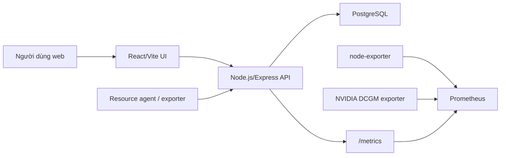

# Chốt hướng thực hiện đề tài

## Đề tài

**Xây dựng hệ thống đặt lịch và giám sát tài nguyên phòng thí nghiệm**

Nguồn yêu cầu chính:

- Phiếu giao đề tài của sinh viên Phạm Đình Hưng, mã SV 22010145.
- Ảnh đề xuất đề tài số 19: quản lý GPU server, Raspberry Pi, UAV, camera và thiết bị dùng chung; web app có đặt lịch, phê duyệt, trạng thái online/offline, nhật ký sử dụng và thông báo.

## Hướng chốt

Xây dựng một nền tảng web nội bộ cho phòng thí nghiệm, tập trung vào hai năng lực:

1. **Resource booking workflow**: sinh viên/giảng viên gửi yêu cầu, hệ thống kiểm tra trùng lịch, cán bộ lab duyệt, bàn giao, tiếp nhận hoàn trả và lưu nhật ký.
2. **Resource observability**: hệ thống nhận telemetry từ server/thiết bị, xuất metrics cho Prometheus, hiển thị tình trạng CPU/GPU/RAM/dung lượng/online-offline trên dashboard.

## Căn cứ kỹ thuật tham khảo

- Prometheus là toolkit mã nguồn mở cho monitoring/alerting, phù hợp làm lớp thu thập time-series metrics: https://prometheus.io/docs/introduction/overview/
- Node Exporter là exporter chính thức để thu thập hardware/kernel metrics của Linux host: https://prometheus.io/docs/guides/node-exporter/
- NVIDIA DCGM-Exporter xuất GPU metrics ở endpoint `/metrics` để Prometheus scrape: https://docs.nvidia.com/datacenter/dcgm/latest/gpu-telemetry/dcgm-exporter.html
- PostgreSQL range types và exclusion constraints phù hợp để ngăn lịch đặt bị overlap ở tầng dữ liệu: https://www.postgresql.org/docs/current/rangetypes.html
- Express là framework web tối giản cho Node.js, phù hợp để học routing/middleware và xây API dễ hiểu: https://expressjs.com/
- Prisma schema là cách mô tả database, quan hệ và Prisma Client trong một file dễ đọc: https://www.prisma.io/docs/orm/prisma-schema/overview
- Vite là công cụ scaffold/build nhanh cho React app: https://vite.dev/guide/

## Phạm vi sản phẩm triển khai

- Đăng nhập bằng tài khoản thật và phân quyền theo vai trò.
- Dashboard tổng quan: số tài nguyên, lịch đang chờ duyệt, lịch sắp tới, cảnh báo telemetry.
- Danh mục tài nguyên: loại, vị trí, trạng thái, yêu cầu phê duyệt, thông số kỹ thuật.
- Đặt lịch: chọn tài nguyên, nhập thời gian, mục đích; hệ thống kiểm tra overlap.
- Duyệt lịch: cán bộ lab/admin duyệt hoặc từ chối; sinh viên/giảng viên theo dõi trạng thái.
- Bàn giao/hoàn trả: chuyển trạng thái booking, lưu usage log.
- Telemetry: nhận chỉ số qua API, cập nhật trạng thái thiết bị và xuất Prometheus metrics.
- Notification: sinh thông báo khi lịch được tạo, duyệt, từ chối hoặc cần thao tác.

## Production baseline

- Local development và production đều chỉ tạo admin đầu tiên từ biến môi trường qua `backend/prisma/seedAdmin.js`.
- Resource inventory thật được nhập qua UI hoặc CSV theo `data/resource-inventory.template.csv`.
- Telemetry thật được gửi qua `backend/agents/systemMetricsAgent.js` hoặc Prometheus exporters.
- Deployment production dùng `docker-compose.prod.yml`, Nginx frontend, Express backend, PostgreSQL và Prometheus.
- Health/readiness endpoint: `/health` và `/health/ready`.

## Kiến trúc

## Quyết định stack

- **Frontend**: React + Vite bằng JavaScript/JSX, CSS thuần để dễ kiểm soát giao diện và không phụ thuộc design system nặng.
- **Backend**: Node.js + Express bằng JavaScript, dễ học vì dùng cùng ngôn ngữ với frontend.
- **ORM**: Prisma, giúp schema database dễ đọc và dễ giải thích trong báo cáo.
- **Database**: PostgreSQL trong Docker, dùng cùng một loại database cho phát triển và triển khai.
- **Monitoring**: Prometheus scrape API metrics, node-exporter cho server metrics, DCGM exporter cho GPU.

## Mô hình dữ liệu lõi

- `users`: tài khoản, vai trò, trạng thái hoạt động.
- `resources`: tài nguyên phòng lab, loại, trạng thái, vị trí, specs.
- `bookings`: lịch đặt, người yêu cầu, người duyệt, thời gian, trạng thái.
- `usage_logs`: nhật ký yêu cầu, duyệt, bàn giao, hoàn trả, đổi trạng thái.
- `notifications`: thông báo trong hệ thống.
- `telemetry_samples`: chỉ số CPU/GPU/RAM/disk/nhiệt độ/online.

## Hướng mở rộng cho báo cáo tốt nghiệp

- Ràng buộc chống overlap bằng PostgreSQL exclusion constraint qua script `backend/prisma/applyBookingGuard.js`.
- Thêm agent cài trên GPU server/Raspberry Pi để gửi telemetry định kỳ.
- Tích hợp email/Zalo/Telegram notification.
- Thêm QR code cho quy trình bàn giao thiết bị.
- Thêm dashboard Grafana đọc từ Prometheus.
- Thêm module bảo trì định kỳ và incident reporting.
