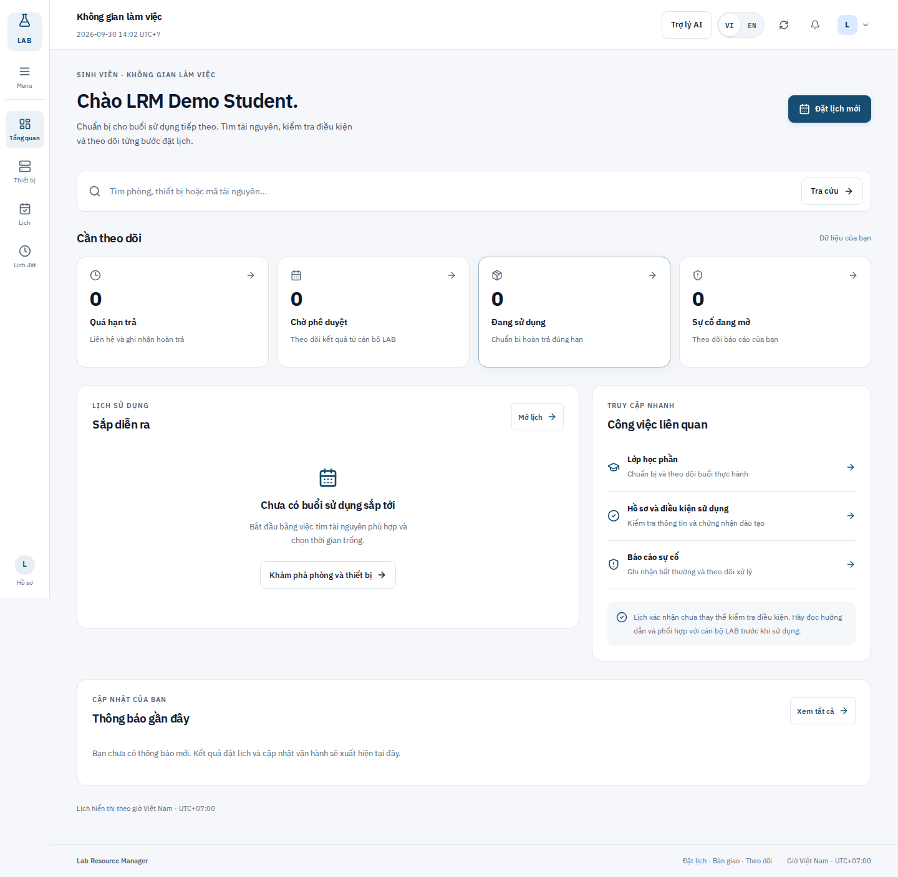
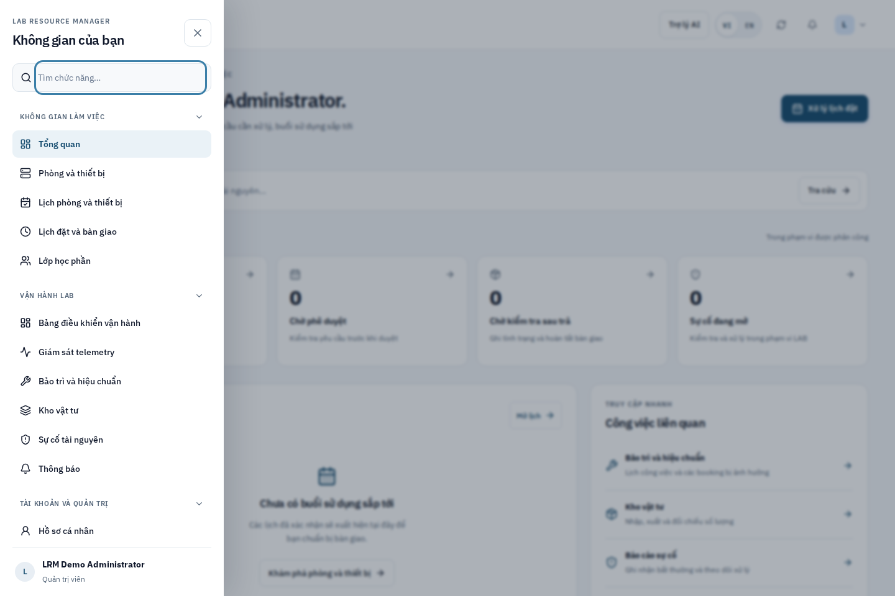
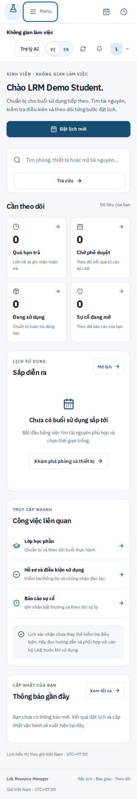

# Workspace navigation and role overview — 30 September 2026

Continuation of the interrupted UI task on `codex/lab-workspace-ui-draft`, draft
PR #22, starting from `5c1ec83de60a58ca7820ca3bcc81be59f560a542`.
The existing resource dossier, stock, maintenance and course workflows remain
part of this cumulative draft. This update is not a new numbered Batch.

## Result

- Fresh login enters `#/workspace/tong-quan` inside the authenticated shell.
  Restored sessions, permitted deep links, Back/Forward, refresh and the
  mandatory temporary-password change retain the existing route/auth behavior.
- Desktop uses a narrow quick-access rail. The complete navigation appears only
  after pressing **Menu**, with role-filtered groups, Vietnamese search without
  accents, active-page indicators and unread/open-incident counts from API data.
  On mobile, the rail becomes a compact top bar; the same full menu is available.
- The drawer places focus in search, traps Tab within visible controls, makes
  the background inert and restores focus on Escape/close. Choosing a screen
  closes the menu and focuses the main content. Reduced-motion preferences are
  honored. Group links can be collapsed without losing the rest of navigation.
- The overview prioritizes overdue returns, pending approval, inspection or
  current use, upcoming confirmed sessions and recent notifications. Staff see
  operation shortcuts; students and lecturers see course/profile preparation.
  Counts use existing scoped API records and canonical statuses. Empty data,
  loading and failure have separate presentations; failed reads do not show
  reassuring zero counts. Schedule times remain in Vietnam time.
- Shared spacing, white/navy surfaces, buttons, header and responsive shell
  styling apply to all authenticated screens. The account menu links directly
  to the personal profile. The public catalog keeps its own layout.
- No runtime dependency, schema/migration, role, booking status or backend
  authorization change was introduced. Client menu visibility is presentation;
  existing backend RBAC remains authoritative.

## Verification

| Check | Result and scope |
| --- | --- |
| `frontend: npm run test:required` | PASS: lint, TypeScript and production build; 14 pre-existing lint warnings, 0 errors |
| Backend lint and `npm test` | PASS: required unit/release checks |
| `frontend: npm run test:phase-g` | PASS: timezone, booking wizard, eligibility and temporary-account contracts |
| `frontend: npm run test:ui:workspace` | PASS: 104 checks on a fresh migrated PostgreSQL 16 demo, all four roles, keyboard, history, VI/EN, menu gates and failure handling |
| `test_lab_workspace_e2e.mjs` | PASS: 78 checks across actual role screens, desktop/mobile, language, search, resource details and pagination; no browser exceptions |
| `test_resource_dossier_ui.mjs` | PASS: 23 isolated browser fixture checks, gallery/error handling and guides preserving resource specs |
| Batch 2 auth full-stack E2E | PASS: PostgreSQL-backed login, all-role navigation, session restoration and logout |
| Batch 4 calendar full-stack E2E | PASS: PostgreSQL-backed booking/conflicts/approval/cancellation and mobile calendar |
| Batch 5 operations full-stack E2E | PASS: PostgreSQL-backed handover/return, owner visibility, scoped staff and admin behavior |
| `git diff --check` and changed E2E script syntax | PASS |

Viewports: 375, 768, 1024 and 1440 px for overview/navigation and dossier checks.
Only authentication and reads were used by the new navigation suite, apart from
an intercepted booking-read failure for each role. Required workflow E2E used
separate, newly migrated/seeded local databases; no shared user database was used.
The test rate-limit override is restricted to the isolated local/CI environment.

The new `workspace-navigation` CI job runs the guarded demo launcher against an
ephemeral PostgreSQL 16 service and uploads screenshots/results. Existing E2E
scripts now open the drawer explicitly before choosing its stable `data-nav-id`
links; domain assertions remain in place. GitHub runs on the previous branch head
passed all nine workflows. Results on the new commit are tracked in PR #22.
The first continuation run passed CI (including the 104 new checks), but the
graduation demo's broad `aside` selector also matched the overview's related-work
panel. The selector now targets the open navigation drawer explicitly; its
optional-feature assertions and all ten persisted workflow steps are retained.

The production main JS entry is 441.25 kB / 130.09 kB gzip, compared with
434.92 / 128.55 kB at the starting checkpoint. The added shell/overview costs
about 1.5% of the entry size. Existing lazy-loaded screens remain split; this
measurement is entry JS rather than total downloaded application bytes.

## Visual evidence

Machine-readable navigation results:
`docs/screenshots/workspace_20260930/navigation-results.json`.

## References and boundaries

Consulted the official [UI UX Pro Max reference](https://github.com/nextlevelbuilder/ui-ux-pro-max-skill),
its minimal-dashboard design search and keyboard/focus guidance. Also consulted
[Carbon's accessible navigation](https://carbondesignsystem.com/components/UI-shell-left-panel/accessibility/),
[Linear's UI redesign](https://linear.app/now/how-we-redesigned-the-linear-ui)
and [Linear's design refresh](https://linear.app/now/behind-the-latest-design-refresh).
Applied compact navigation, hierarchy, progressive disclosure and visible focus
within the existing React/Vite, IBM Plex, Lucide and white/navy system.

The PostgreSQL evidence above is local integration evidence for these flows.
It does not establish production deployment or real institution acceptance.
Physical telemetry/hardware, SMTP, signed VNPAY transactions, and live S3/R2
uploads remain outside this UI verification. Real equipment instructions and
institution media still need validated content from the managing unit.
PR #22 remains draft for review; `main` is not changed by this continuation.
