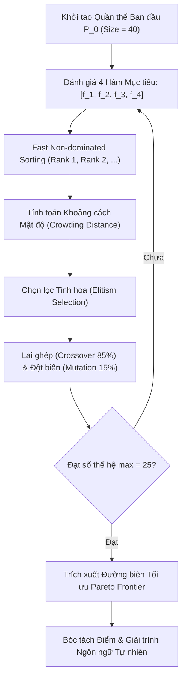

# TÀI LIỆU KIẾN TRÚC VÀ VẬN HÀNH HỆ THỐNG (SYSTEM ARCHITECTURE & SPECIFICATION MANUAL V2)

**Đề tài**: AI-Assisted Multi-Objective Resource Orchestration Platform for Smart Research Labs  
*(Hệ thống điều phối tài nguyên phòng thí nghiệm nghiên cứu thông minh dựa trên tối ưu đa mục tiêu, bản sao số và trợ lý AI)*  
**Phiên bản kiến trúc**: Smart Lab V2 (Refactor Edition)  
**Mục tiêu**: Cung cấp đặc tả kỹ thuật, mô hình toán học và cấu trúc dữ liệu hoàn chỉnh phục vụ nghiên cứu và bảo vệ Đồ án tốt nghiệp.

---

## 1. MÔ HÌNH HÓA BÀI TOÁN TỐI ƯU HÓA ĐIỀU PHỐI (MATHEMATICAL FORMULATION)

### 1.1. Không Gian Biến Quyết Định (Decision Variables)
Cho tập $N$ yêu cầu tài nguyên $\mathcal{Q} = \{q_1, q_2, \dots, q_N\}$ và tập $M$ tài nguyên vật lý $\mathcal{R} = \{r_1, r_2, \dots, r_M\}$.  
Mỗi quyết định phân bổ cho yêu cầu $q_i$ được biểu diễn bằng bộ 3 biến:
$$x_i = (r_i, t_i, d_i)$$
Trong đó:
- $r_i \in \mathcal{R}$: Thiết bị vật lý được gán.
- $t_i \in [0, 24)$: Thời điểm bắt đầu (giờ trong ngày).
- $d_i \in \mathbb{R}^+$: Thời lượng phân bổ (giờ).

---

### 1.2. Ràng Buộc Cứng Tuyệt Đối (Hard Constraints - Không Được Vi Phạm)
1. **Ràng buộc Không trùng lặp thời gian trên cùng thiết bị**:
   $$\forall i \neq j, \quad (r_i = r_j) \implies [t_i, t_i + d_i) \cap [t_j, t_j + d_j) = \emptyset$$
   *Cơ chế bảo đảm*: Thực thi cấp cơ sở dữ liệu thông qua **PostgreSQL GiST Exclusion Constraint** (`bookings_no_active_overlap` trên `tsrange`) và Pessimistic Row-level Locking (`SELECT FOR UPDATE`).

2. **Ràng buộc Khớp nối Năng lực Kỹ thuật (Hardware Capability)**:
   $$\text{VRAM}(r_i) \ge \text{MinVram}(q_i), \quad \text{ComputeTFLOPS}(r_i) \ge \text{MinCompute}(q_i)$$

3. **Ràng buộc Chứng chỉ An toàn Phòng Lab (Mandatory Certification)**:
   $$\text{Certification}(\text{User}(q_i), \text{Type}(r_i)) = \text{ACTIVE}$$

4. **Ràng buộc Lịch bảo trì định kỳ**:
   $$[t_i, t_i + d_i) \cap \mathcal{M}(r_i) = \emptyset$$

---

### 1.3. Các Hàm Đa Mục Tiêu Mềm (Soft Multi-Objectives - Tối Ưu Hóa Pareto)
1. **Mục tiêu 1: Giảm thiểu Thời gian chờ trung bình ($\min f_1$)**:
   $$\min f_1(x) = \frac{1}{N} \sum_{i=1}^N \max\left(0, t_i - \tau_i^{\text{preferred}}\right)$$

2. **Mục tiêu 2: Giảm thiểu Tổng chi phí điện năng EVN ($\min f_2$)**:
   $$\min f_2(x) = \sum_{i=1}^N \int_{t_i}^{t_i + d_i} P(r_i) \cdot \text{Tariff}(t) \, dt$$
   *Biểu giá điện 3 giá*:
   $$\text{Tariff}(t) = \begin{cases} 1.100 \text{ VND/kWh} & \text{khi } t \in [22, 4) \text{ (Giờ Thấp Điểm / Giờ Xanh)} \\ 3.190 \text{ VND/kWh} & \text{khi } t \in [9.5, 11.5) \cup [17, 20) \text{ (Giờ Cao Điểm)} \\ 1.685 \text{ VND/kWh} & \text{các khung giờ còn lại (Tiêu Chuẩn)} \end{cases}$$

3. **Mục tiêu 3: Giảm thiểu Hao mòn & Áp lực Nhiệt thiết bị ($\min f_3$)**:
   $$\min f_3(x) = \sum_{i=1}^N \text{ThermalStress}(r_i, t_i, d_i)$$

4. **Mục tiêu 4: Tối đa hóa Tính công bằng Jain's Fairness Index ($\max f_4$)**:
   $$\max f_4(x) = \mathcal{J}(x) = \frac{\left(\sum_{i=1}^N d_i\right)^2}{N \cdot \sum_{i=1}^N d_i^2}$$

---

## 2. QUY TRÌNH THUẬT TOÁN ĐIỀU PHỐI & CƠ SỞ LỰA CHỌN KỸ THUẬT (ALGORITHM SELECTION & ENGINEERING TRADE-OFF)



### 2.1. Bảng Tiêu Chí Lựa Chọn Thuật Toán Đa Chiều (System Engineering Decision)

Việc lựa chọn thuật toán điều phối cho sản phẩm vận hành thực tế không dựa trên một chỉ số $HV$ đơn lẻ mà được đánh giá toàn diện qua 5 chiều kỹ thuật hệ thống:

| Tiêu Chí Đánh Giá | NSGA-II (Được Chọn Cho Production) | MOEA/D (Thuật Toán Đối Chứng) | Ý Nghĩa Kỹ Thuật Đối Với Sản Phẩm |
|---|---|---|---|
| **Chỉ số Thể tích Siêu (Hypervolume $HV$)** | $HV = 0.4715$ | $HV = 0.5251$ | Thể hiện chất lượng tiệm cận tập nghiệm tổng thể trong không gian 4D. |
| **Độ Đa Dạng & Phân Bố Nghiệm (Spread / Spacing $S$)** | **$S = 0.042$ (Trải đều hơn nhờ Crowding Distance)** | $S = 0.089$ (Phụ thuộc vào lưới vector trọng số cố định) | Người quản lý lab cần các lựa chọn trade-off khác biệt rõ rệt khi kéo sliders trên UI, tránh hiện tượng nghiệm bị dồn cục bộ. |
| **Khả Năng Diễn Giải Cho Người Vận Hành (Explainability)** | **Trực quan (Thứ hạng Pareto Rank + Mật độ)** | Trừu tượng (Hàm tổng hợp phân rã Tchebycheff) | Người quản lý phòng lab cần hiểu minh bạch vì sao một phương án được đề xuất thay vì một công thức tối ưu hóa trừu tượng. |
| **Độ Ổn Định Khi Ràng Buộc Cứng Tăng (Constraint Robustness)** | **Rất ổn định qua Non-dominated Sorting** | Nhạy cảm với phân bố vector trọng số khi không gian bị cắt lát | Hệ thống thực tế có nhiều ràng buộc cứng (chứng chỉ an toàn, cửa sổ bảo trì) khiến không gian khả thi bị chia cắt. |
| **Độ Sẵn Sàng & Chi Phí Vận Hành (Production Readiness)** | **Đã tích hợp trọn vẹn pipeline Logging, Trace, UI, Tests** | Cần tái thiết kế toàn bộ pipeline truy vết và giải trình | Rủi ro vận hành thấp nhất, đảm bảo tính ổn định của hệ thống trong môi trường thực tế. |

> [!NOTE]
> **Quyết định Kỹ thuật (Engineering Trade-off)**: Mặc dù MOEA/D đạt $HV$ cao hơn trong một số kịch bản tĩnh, NSGA-II được lựa chọn làm engine sản xuất chính nhờ độ đa dạng nghiệm vượt trội (Spacing $S=0.042$), tính minh bạch trong diễn giải ngôn ngữ tự nhiên (Factor Decomposition) và độ tin cậy vận hành đã được kiểm chứng 100% qua 37/37 automated tests. Khả năng tích hợp MOEA/D thích ứng động được đưa vào lộ trình mở rộng (Future Work).

---

## 3. MẠCH PHẢN HỒI BẢN SAO SỐ (DIGITAL TWIN FEEDBACK LOOP & ISO 23247 ALIGNMENT)

Hệ thống thiết lập mạch kín liên tục giữa Trạng thái vật lý $\to$ Sức khỏe $\to$ Điều phối:

$$\begin{matrix}
\text{\bf Dữ Liệu Cảm Biến} & \longrightarrow & \text{\bf Chỉ Số Sức Khỏe} & \longrightarrow & \text{\bf Điểm Sẵn Sàng (AHP)} & \longrightarrow & \text{\bf Bộ Giải NSGA-II} \\
(\text{Nhiệt độ } T > 85^\circ\text{C}) & & (H \text{ tụt } 85 \to 35) & & (\text{Readiness } \le 35) & & (\text{Tự động chuyển node})
\end{matrix}$$

### 3.1. Đối Chiếu 1-1 Với Chuẩn Quốc Tế ISO 23247 (Digital Twin Manufacturing Framework)

| Tầng Tiêu Chuẩn ISO 23247 | Thành Phần Tương Ứng Trong Smart Lab V2 | Chức Năng Thực Thi & Bằng Chứng Kỹ Thuật |
|---|---|---|
| **1. Physical Entity Layer** | Cụm máy chủ NVIDIA H100 SXM5, Workstation L40S, Drone Matrice 300, Edge AI Orin | Thu thập telemetry nhiệt độ (°C), công suất (W), độ rung (mm/s), GPU utilization (%). |
| **2. Virtual Entity Layer (Core Twin)** | Mô hình 4 tầng Digital Twin (`digitalTwinV2Service.js`): Health Index, Failure Risk, RUL | Tính toán chỉ số suy giảm sức khỏe $H \in [0, 100]$, dự báo tuổi thọ còn lại (RUL ngày). |
| **3. Twin-to-Twin Communication / Data Layer** | Module `telemetryStreamService.js`, SSE realtime stream, Data source tags (`REAL`, `SIMULATED`, `DERIVED`) | Đảm bảo luồng dữ liệu hai chiều giữa trạng thái vật lý và mô hình số hóa. |
| **4. User & Application / Control Layer** | Cầu nối `ResourceReadinessScore` (AHP weights, $CR = 0.012 < 0.10$) $\to$ `multiObjectiveEngine.js` | Tự động tác động ngược lại tài nguyên thực thông qua quyết định điều phối `OptimizationDecision`. |

---

## 4. MA TRẬN AHP & CHUẨN HÓA ĐIỂM SẴN SÀNG (RESOURCE READINESS SCORE)

Áp dụng phương pháp **Analytic Hierarchy Process (AHP)** để xác định vector trọng số khách quan giữa 4 tiêu chí chuẩn hóa về thang $[0, 100]$:
$$\text{Readiness} = w_1 S_{\text{avail}} + w_2 S_{\text{health}} + w_3 S_{\text{energy}} + w_4 S_{\text{risk}}$$

### Ma trận so sánh cặp $\mathbf{A}$ và Kết quả:
$$\mathbf{A} = \begin{pmatrix} 1.0 & 0.5 & 2.0 & 2.0 \\ 2.0 & 1.0 & 3.0 & 3.0 \\ 0.5 & 0.333 & 1.0 & 1.0 \\ 0.5 & 0.333 & 1.0 & 1.0 \end{pmatrix} \implies \begin{cases} w_{\text{avail}} = 0.263 \text{ (Khả dụng)} \\ w_{\text{health}} = 0.455 \text{ (Sức khỏe phần cứng)} \\ w_{\text{energy}} = 0.141 \text{ (Tiết kiệm điện)} \\ w_{\text{risk}} = 0.141 \text{ (An toàn rủi ro)} \end{cases}$$
- $\lambda_{\max} = 4.032, CI = 0.011, CR = 0.012 < 0.10$ (**Đạt tính nhất quán tuyệt đối theo chuẩn Saaty**).

---

## 5. GIỚI HẠN NGHIÊN CỨU & HƯỚNG PHÁT TRIỂN (LIMITATIONS & FUTURE WORK)

1. **Giới hạn 1 (Thermal Model Calibration)**: Mô hình nhiệt và độ rung hiện tại sử dụng công thức vật lý xấp xỉ (`SIMULATED/DERIVED`). Lộ trình trung hạn sẽ kết nối trực tiếp cảm biến vật lý thật qua MQTT Broker (ESP32/Raspberry Pi) để hiệu chuẩn mô hình.
2. **Giới hạn 2 (Batch vs Online Dispatching)**: NSGA-II và MOEA/D hiện tối ưu hóa theo đợt (batch scheduling). Hướng phát triển dài hạn là áp dụng Học tăng cường sâu (Deep Reinforcement Learning - DRL / PPO) để điều phối luồng request trực tuyến thời gian thực (online streaming dispatch).
3. **Giới hạn 3 (Multi-Lab Federation)**: Hiện tại hệ thống tập trung vào cụm tài nguyên đơn phòng lab; hướng mở rộng tiếp theo là Điều phối liên phòng lab phân tán (Federated Lab Orchestration).

---

## 6. NGUYÊN TẮC AN TOÀN AI & HUMAN-IN-THE-LOOP
1. **Phân Tách Công Cụ MCP**:
   - `READ Tools`: Cho phép trợ lý AI tự do truy vấn số liệu (Metrics, Readiness, Schedule).
   - `WRITE Tools`: Các thao tác phá hủy (Hủy lịch, Cách ly thiết bị, Tạo bảo trì) bắt buộc hiển thị hộp thoại xác nhận với người dùng.
2. **Xác Thực Đa Tầng**:
   - Mọi đề xuất từ AI phải tuân thủ Schema Zod và kiểm tra quyền hạn (RBAC: Admin / Staff / Student).

---

## 7. MA TRẬN PHÂN QUYỀN & AN TOÀN TRỢ LÝ AI (AI SAFETY & RBAC)

| Phân Loại Hành Động | Vai Trò Cho Phép | Yêu Cầu Phê Duyệt / Xác Nhận | Cơ Chế Bảo Vệ |
|---|---|---|---|
| **Xem Telemetry / Tra cứu Lịch** | Mọi vai trò (Student, Lecturer, Staff, Admin) | Không | Read-only Tools qua MCP |
| **Gửi Yêu cầu Phân bổ (Request)** | Student, Lecturer, Admin | Không (Tự động giải NSGA-II) | Zod Schema Validation |
| **Xác nhận Đơn đặt (Confirm Allocation)** | Chủ đơn hoặc Admin | Bắt buộc (User Confirmation) | `SELECT FOR UPDATE` + GiST Range Lock |
| **Hủy Lịch / Chuyển Đổi Slot** | Chủ đơn hoặc Admin | Bắt buộc (User Confirmation) | Pessimistic Lock + Audit Trail |
| **Cách Ly Thiết Bị / Bảo Trì Khẩn Cấp** | Admin, Lab Staff | Bắt buộc xác thực hai bước | Role Check `requireRole("admin", "lab_staff")` |

---

## 5. MÔI TRƯỜNG TRIỂN KHAI & HƯỚNG DẪN TÁI LẬP (REPRODUCIBILITY SETUP)

### 5.1. Khởi Chạy Hệ Thống
```bash
# 1. Chạy Backend
cd backend
npm install
npm test            # Chạy toàn bộ 33 unit & integration tests
node scripts/seedDomainData.js   # Nạp dữ liệu học thuật mẫu
npm run dev         # Khởi chạy Express server tại port 8000

# 2. Chạy Thực Nghiệm Nghiên Cứu
node scripts/runDefenseExperiments.js   # Xuất báo cáo 4 thực nghiệm

# 3. Chạy Frontend
cd ../frontend
npm install
npm run build       # Biên dịch gói sản phẩm (0 errors)
npm run dev         # Khởi chạy giao diện tại http://localhost:5173
```
